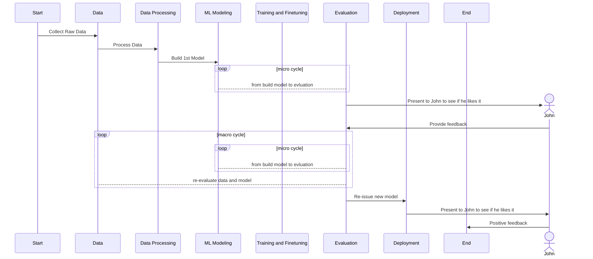

## How to run an AI/ML project?

```mermaid
sequenceDiagram

    participant S as Start
    participant DC as Data
    participant DP as Data Processing
    participant ML as ML Modeling
    participant T as Training and Finetuning
    participant E as Evaluation
    participant D as Deployment
    participant ED as End

    S->>DC: Collect Raw Data
    DC->>DP: Process Data
    DP->>ML: Build 1st Model

    loop micro cycle
        ML-->E: from build model to evluation
    end
    create actor JOHN as John
    E->>JOHN: Present to John to see if he likes it
    JOHN->>E: Provide feedback
    loop macro cycle
        loop micro cycle
            ML-->E: from build model to evluation
        end
        E-->DC: re-evaluate data and model
    end
    E->>D: Re-issue new model
    D->>JOHN: Present to John to see if he likes it
    JOHN->>ED: Positive feedback
```

